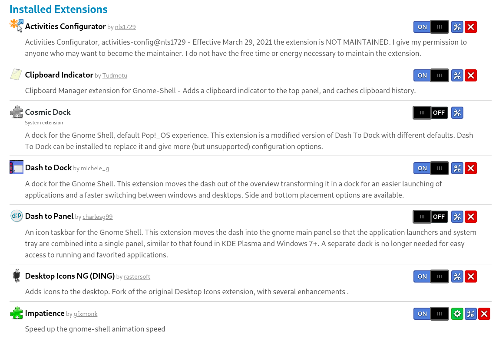
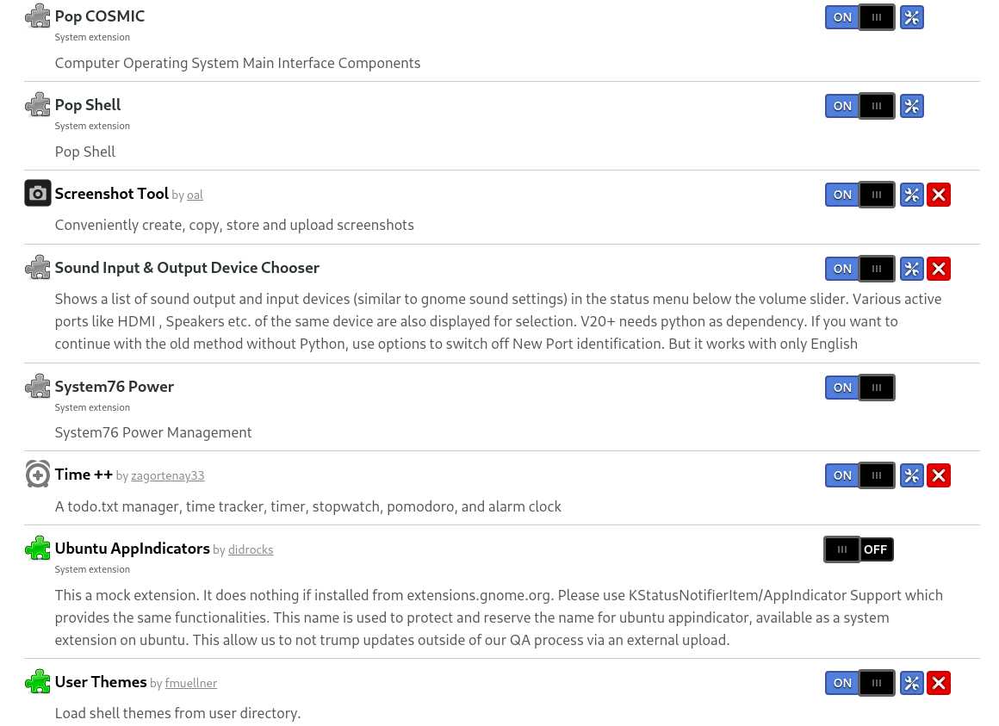

# Arch Linux setup

## Base installation

## list
```
pacman -S grub efibootmgr networkmanager network-manager-applet wireless_tools wpa_supplicant dialog os-prober mtools dosfstools base base-devel linux-headers
```
## GRUB
```
grub-install --target=x86_64-efi --efi-directory=/boot/EFI --bootloader-id=GRUB
grub-mkconfig -o /boot/grub/grub.cfg
```
## Install paru AUR helper
```
sudo pacman -S --needed base-devel
git clone https://aur.archlinux.org/paru.git
cd paru
makepkg -si
```

## Application installation

### 1. My dot files
```
git clone https://github.com/M-Mabrouk1/.dotfiles
```
### 2. Set Zsh directory
```
sudo vim /etc/zsh/zshenv
export ZDOTDIR=$HOME/.config/zsh
```
### 3. Setup hybrid graphics
```
sudo system76-power graphics hybrid
sudo reboot now
```
### 4. Install piper for mouse control
```
sudo apt install piper
```
### 5. Install extreme cooling for fan managing

### [Extreme cooling download page](https://odintdh.itch.io/extremecooling4linux)

### 6. Install neofetch and htop
```
sudo apt install neofetch
sudo apt install htop
```
### 7. Enable TRIM for SSD drives (for extending life)
```
sudo systemctl enable fstrim.timer
```
### 8. Install express vpn

### 9. Install snap for snap app installation
```
sudo apt install snapd
```
### 10. Install Rest of apps from terminal or shop


### 11. Install Gnome tweaks
```
sudo apt install gnome-tweak-tool
```
### 12. Backup and Restore Gnome tweaks configuration

Backup
```
cd ~
dconf dump / > saved_settings.dconf
```
Restore
```
cd ~
dconf load / < saved_settings.dconf
```
### [Gnome extensions](https://extensions.gnome.org)



### 13. Setup my dotfiles from my github
### [.dotfiles repo](https://github.com/M-Mabrouk1/.dotfiles.git)


### 99. Miscellaneous 
check tldr, dust, ripgrep


### table syntax
| Syntax      | Description | Test Text     |
| :---        |    :----:   |          ---: |
| Header      | Title       | Here's this   <br> 7amada |
| Paragraph   | Text        | And more      |